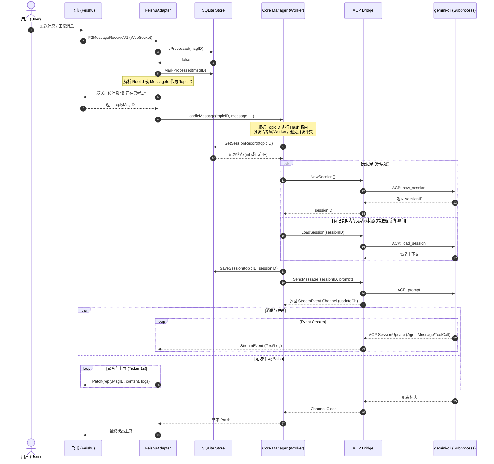

# Gembot

Gembot 是一个将 `gemini-cli` 代理能力接入即时通讯平台（如飞书）的中间件服务。它利用 ACP (Agent Client Protocol) 协议与底层 `gemini-cli` 进程通信，管理并发会话，并处理平台特定的消息交互与展示。

## 核心架构时序图

以下时序图展示了 Gembot 处理一条消息的完整生命周期：

## 工程规范与架构亮点

* **Hash Routing**: 基于 TopicID 的一致性哈希路由确保同一会话的消息串行处理。
* **Fail-Safe 机制**: `Manager` 层具备 `recover` 与异常捕获机制，保证飞书侧的消息不会永久悬挂为“正在思考...”。
* **Idempotency**: 通过 SQLite 的 `processed_messages` 表防止 WebSocket 重传导致的消息重复执行。
* **接口隔离**: 抽象 `core.Adapter` 与 `acp.Bridge`，核心逻辑与具体 IM 平台和协议解耦。
